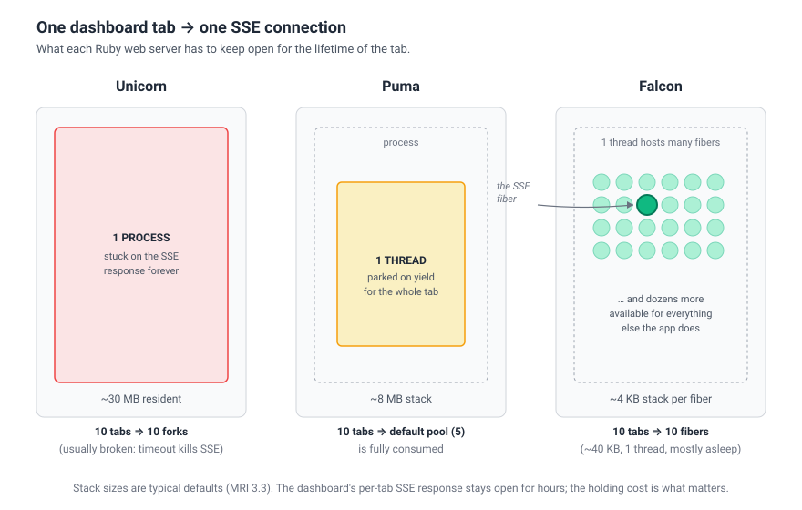

# Async::Background

A lightweight cron, interval, and job-queue scheduler for Ruby's
[Async](https://github.com/socketry/async) ecosystem. Built for
[Falcon](https://github.com/socketry/falcon), works with any Async app.

- **Cron & interval scheduling** on a single event loop with a min-heap.
- **Dynamic job queue** backed by SQLite, with delayed jobs
  (`perform_in` / `perform_at`).
- **Cross-process wake-ups** over Unix domain sockets — web workers can
  enqueue and instantly wake background workers.
- **Multi-process safe** — deterministic worker sharding, no duplicate
  execution.
- **Per-job timeouts**, skip-on-overlap, startup jitter, optional metrics.

---

## Why Async? Why fibers?

The whole gem is built around the assumption that Falcon's reactor schedules
many fibers on top of one OS thread per process — so the dashboard's SSE
stream, the cron scheduler, and the queue worker all share that one thread
cooperatively. A blocked fiber yields; a blocked thread doesn't.



That's also why the dashboard (since 1.0.1) runs its SSE loop entirely inside
the request fiber: zero extra threads, zero `ConditionVariable`, ~4 KB per
open tab.

---

## Requirements

| Dependency           | Version          | Required?            |
| -------------------- | ---------------- | -------------------- |
| Ruby                 | `>= 3.3`         | yes                  |
| `async`              | `~> 2.0`         | yes                  |
| `fugit`              | `~> 1.0`         | yes                  |
| `sqlite3`            | `~> 2.0`         | for the queue & dashboard |
| `async-utilization`  | `>= 0.3, < 0.5`  | for metrics          |

---

## Install

```ruby
# Gemfile
gem "async-background"

gem "sqlite3",           "~> 2.0"          # if you use the queue or dashboard
gem "async-utilization", ">= 0.3", "< 0.5" # if you want worker metrics
```

---

## ➡️ [Get started](docs/GET_STARTED.md)

A four-step walkthrough: schedule config, Falcon integration, Docker, queue,
delayed jobs.

---

## Quick look

```ruby
class SendEmailJob
  include Async::Background::Job

  def perform(user_id, template)
    Mailer.send(User.find(user_id), template)
  end
end

SendEmailJob.perform_async(user_id, "welcome")
SendEmailJob.perform_in(300, user_id, "reminder")
SendEmailJob.perform_at(Time.new(2026, 4, 1, 9), user_id, "scheduled")
```

Schedule recurring jobs in `config/schedule.yml`:

```yaml
sync_products:
  class: SyncProductsJob
  every: 60

daily_report:
  class: DailyReportJob
  cron: "0 3 * * *"
  timeout: 120
```

| Key              | Description                                                     |
| ---------------- | --------------------------------------------------------------- |
| `class`          | Job class — must include `Async::Background::Job`.              |
| `every` / `cron` | Interval in seconds, or a cron expression. Exactly one.         |
| `timeout`        | Max execution time in seconds. Default: 30.                     |
| `worker`         | Pin to a specific worker. Default: `crc32(name) % total_workers`. |

---

## Gotchas

**Docker + SQLite — use a named volume.**
SQLite's database must not live on Docker's default `overlay2` filesystem:
`overlay2` breaks coherence between `write()` and `mmap()`, which corrupts
the WAL under concurrent access. Mount the queue directory as a named volume,
or pass `mmap: false` to `Store.new`. See
[Get Started → Docker](docs/GET_STARTED.md#step-3--docker-setup).

**Don't share SQLite connections across `fork()`.**
The gem opens connections lazily after fork. If you build a `Store` manually
for schema setup, close it before forking.

**Two clocks, on purpose.**
Interval jobs use `CLOCK_MONOTONIC` so NTP drift can't fire them twice. Cron
jobs use wall-clock time, because "every day at 3am" needs to mean 3am.

---

## How it works

A single Async task sleeps until the next entry is due, then dispatches it
under a semaphore that caps concurrency. Overlapping ticks are skipped and
rescheduled.

```
schedule.yml → build_heap → MinHeap<Entry> → scheduler loop → Semaphore → run_job
```

The dynamic queue runs alongside it:

```
   Producer (web / console)                Consumer (background worker)
          │                                          │
          ▼                                          ▼
    Queue::Client                            Queue::Store#fetch
   push / push_in / push_at                  (run_at <= now)
          │                                          ▲
          ▼                                          │
    Queue::Store ──── SQLite (jobs) ──── SocketWaker │
          │                                          ▲
          └─────────► SocketNotifier ────────────────┘
                      (UNIX socket wake-up, ~80µs)
```

Jobs are persisted in SQLite, so a missed wake-up is never a lost job —
workers also poll every 5 seconds as a safety net.

---

## Metrics

Metrics are an optional integration with `async-utilization`. With the gem
installed, each worker publishes counters to a shared-memory segment:

```ruby
runner.metrics.values
# => { total_runs: 142, total_successes: 140, total_failures: 2,
#      total_timeouts: 0, total_skips: 5, active_jobs: 1, ... }

Async::Background::Metrics.read_all(total_workers: 2)
# => [{ worker: 1, ... }, { worker: 2, ... }]
```

Without the gem, `runner.metrics.enabled?` is `false` and `read_all` returns
`[]` — no `LoadError` to rescue. Configuration and the cross-container
shared-memory path are covered in
[Get Started → Optional metrics](docs/GET_STARTED.md#appendix-optional-metrics).

---

## License

MIT.
